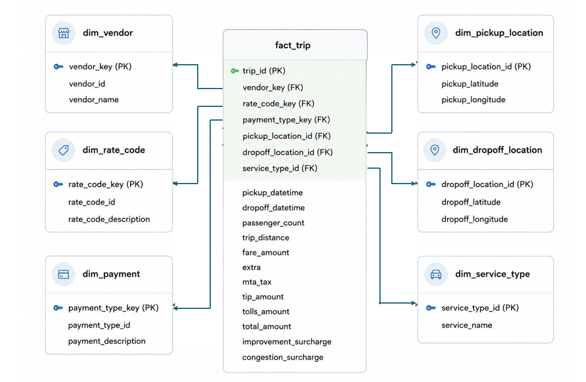

# NYC Taxi Data Pipeline

A complete data engineering project for building a modern batch and streaming data pipeline using the NYC Taxi dataset.  
The project demonstrates how raw taxi trip data can be ingested, processed, validated, stored in a data lake/lakehouse, and transformed into an analytics-ready data warehouse.

## 1. Project Overview

This project simulates a real-world data platform with both **batch processing** and **stream processing**.

The main goals are:

- Ingest NYC Taxi trip data from Parquet files.
- Store raw and processed data in a data lake.
- Process large datasets using Apache Spark.
- Simulate real-time data streaming using PostgreSQL, Debezium, Kafka, and Spark Structured Streaming.
- Store reliable processed data using Delta Lake.
- Query data lake tables using Trino and Hive Metastore.
- Build an analytics-ready data warehouse using dbt.
- Validate data quality using Great Expectations.
- Orchestrate the whole workflow using Apache Airflow.

## 2. System Architecture

.png>)

The architecture contains the following major layers:

| Layer | Technology | Main Responsibility |
|---|---|---|
| Data Source | NYC Taxi Parquet files | Original taxi trip dataset |
| Data Lake Storage | MinIO | Store raw, processed, and Delta Lake data |
| Batch Processing | Apache Spark | Clean and transform historical data |
| Stream Simulation | PostgreSQL + Debezium + Kafka | Simulate real-time CDC events |
| Stream Processing | Spark Structured Streaming | Process streaming records from Kafka |
| Lakehouse Layer | Delta Lake | Store reliable, versioned, ACID-compliant data |
| Metadata Layer | Hive Metastore | Store table metadata and schema information |
| Query Engine | Trino | Query data directly from the data lake |
| Data Warehouse | PostgreSQL | Store analytics-ready fact and dimension tables |
| Transformation | dbt | Build star schema models |
| Data Quality | Great Expectations | Validate data before/after transformation |
| Orchestration | Apache Airflow | Schedule and monitor pipeline tasks |

## 3. Data Lake Design

The data lake is designed using **MinIO**, an S3-compatible object storage system.

The lake is divided into different zones:

```text
MinIO
├── raw/
│   ├── batch/
│   └── stream/
├── processed/
│   └── batch/
└── sandbox/
    └── delta/
```

### Raw Zone

The `raw` zone stores original data with minimal changes.

- `raw/batch/`: stores original NYC Taxi Parquet files.
- `raw/stream/`: stores streaming data generated from Kafka/Spark streaming.

### Processed Zone

The `processed` zone stores cleaned and standardized data.

Typical processing includes:

- Standardizing column names.
- Removing invalid or unnecessary columns.
- Handling missing values.
- Joining taxi trip data with location lookup data.
- Converting raw records into a cleaner structure.

### Delta Lake / Sandbox Zone

The `sandbox` zone stores Delta Lake tables.

Delta Lake adds reliability to the data lake by supporting:

- ACID transactions.
- Schema enforcement.
- Time travel.
- Version history.
- Safe batch and stream writes.

## 4. Batch Pipeline

The batch pipeline processes historical NYC Taxi files.

```text
NYC Taxi Parquet files
        ↓
MinIO raw/batch
        ↓
Spark batch processing
        ↓
MinIO processed/batch
        ↓
Delta Lake
        ↓
Data Warehouse / Trino / Analytics
```

Main batch tasks:

1. Load raw Parquet files into MinIO.
2. Read raw files using Spark.
3. Clean and standardize the data.
4. Write the processed data back to MinIO.
5. Convert processed data into Delta Lake format.
6. Load or transform the data into the data warehouse.

## 5. Streaming Pipeline

The streaming pipeline simulates real-time data processing.

Because the NYC Taxi dataset is file-based, the project simulates streaming by inserting Parquet data into PostgreSQL.  
Debezium then captures database changes and sends them to Kafka.

```text
Parquet files
        ↓
PostgreSQL source table
        ↓
Debezium CDC
        ↓
Kafka topic
        ↓
Spark Structured Streaming
        ↓
Delta Lake / Data Lake
```

### Why PostgreSQL and Debezium are used

PostgreSQL acts as an operational source database.  
Debezium captures changes from PostgreSQL using CDC and publishes the changes to Kafka.

This helps simulate a real-world architecture:

```text
Operational Database → CDC → Kafka → Stream Processing → Lakehouse
```

## 6. Data Warehouse Design



The data warehouse follows a **star schema** design.

The central fact table is `fact_trip`, which stores taxi trip transactions.  
It connects to several dimension tables that describe vendors, rate codes, payment types, locations, and service types.

### Fact Table

#### `fact_trip`

The `fact_trip` table stores measurable trip data such as:

- trip_id
- pickup_datetime
- dropoff_datetime
- passenger_count
- trip_distance
- fare_amount
- tip_amount
- tolls_amount
- total_amount
- congestion_surcharge

It also contains foreign keys to dimension tables:

- vendor_key
- rate_code_key
- payment_type_key
- pickup_location_id
- dropoff_location_id
- service_type_id

### Dimension Tables

| Dimension Table | Description |
|---|---|
| `dim_vendor` | Stores taxi vendor information |
| `dim_rate_code` | Stores rate code and rate description |
| `dim_payment` | Stores payment type information |
| `dim_pickup_location` | Stores pickup latitude and longitude |
| `dim_dropoff_location` | Stores dropoff latitude and longitude |
| `dim_service_type` | Stores taxi service type information |

This schema makes analytical queries easier, for example:

- Total revenue by vendor.
- Number of trips by payment type.
- Average trip distance by service type.
- Trip distribution by pickup and dropoff location.
- Revenue trends by date and time.

## 7. Role of Main Technologies

### Apache Airflow

Airflow is used to orchestrate the data pipeline.

It is responsible for:

- Scheduling batch jobs.
- Running Spark jobs.
- Triggering dbt transformations.
- Running data quality checks.
- Monitoring task status and logs.
- Retrying failed tasks.

Airflow does not process data directly.  
It controls when and how each pipeline step runs.

### Apache Spark

Spark is used for both batch and streaming processing.

It is responsible for:

- Reading large Parquet files.
- Cleaning and transforming raw data.
- Processing Kafka streaming data.
- Writing processed data to MinIO and Delta Lake.

### MinIO

MinIO is used as the data lake storage layer.

It stores:

- Raw data.
- Processed data.
- Streaming output.
- Delta Lake tables.

### Delta Lake

Delta Lake adds a transactional layer on top of data lake files.

It provides:

- ACID transactions.
- Schema enforcement.
- Version control.
- Time travel.
- More reliable batch and streaming writes.

### Hive Metastore

Hive Metastore stores metadata for data lake tables.

It keeps information such as:

- Table names.
- Column names.
- Data types.
- Table locations in MinIO.

### Trino

Trino is used as a SQL query engine.

It allows users to query data directly from the data lake without loading all data into a traditional database.

### dbt

dbt is used to transform cleaned data into data warehouse models.

It helps build:

- Fact tables.
- Dimension tables.
- Aggregated reporting tables.
- Reproducible SQL transformation workflows.

### Great Expectations

Great Expectations is used for data quality validation.

Example checks include:

- Required columns must not be null.
- Trip distance must be greater than or equal to 0.
- Fare amount must be valid.
- Primary keys should be unique.
- Foreign keys should match dimension tables.

## 8. Data Flow Summary

```text
Batch Flow:
Parquet Files
    → MinIO Raw
    → Spark Batch Processing
    → MinIO Processed
    → Delta Lake
    → dbt
    → PostgreSQL Data Warehouse

Streaming Flow:
Parquet Files
    → PostgreSQL
    → Debezium
    → Kafka
    → Spark Structured Streaming
    → Delta Lake
    → Data Warehouse / Analytics
```

## 9. Example Analytics Use Cases

This project can support analytical questions such as:

- Which vendor generates the highest revenue?
- What is the average fare amount by payment type?
- Which pickup locations have the highest number of trips?
- What is the average trip distance by service type?
- How does taxi revenue change over time?
- What are the most common pickup and dropoff patterns?

## 10. How to Run

> Note: Adjust commands depending on your local environment and Docker setup.

### Start services

```bash
docker compose up -d
```

### Run Airflow DAGs

Open the Airflow web UI and trigger the required DAGs.

Typical workflow:

```text
1. Extract raw data
2. Transform batch data
3. Convert processed data to Delta Lake
4. Run streaming pipeline
5. Run data quality checks
6. Run dbt models
```

### Run dbt

```bash
dbt run
dbt test
```

### Stop services

```bash
docker compose down
```

## 11. Project Highlights

This project demonstrates practical knowledge of:

- Data lake architecture.
- Batch data processing.
- Stream processing.
- Change Data Capture.
- Kafka-based data ingestion.
- Lakehouse design with Delta Lake.
- SQL analytics with Trino.
- Data warehouse modeling.
- Star schema design.
- dbt transformation.
- Data quality validation.
- Workflow orchestration with Airflow.

## 12. Repository Structure

```text
.
├── .env
├── .gitignore
├── Diagram (3).png
├── Schema.png
├── Makefile
├── README.md
└── ...
```

## 13. Conclusion

This project shows how to build an end-to-end data engineering pipeline using modern tools.  
It combines batch processing, streaming simulation, data lake storage, Delta Lake reliability, data warehouse modeling, and data quality validation.

The architecture is suitable for learning and demonstrating real-world data engineering concepts such as:

```text
Data Lake → Lakehouse → Data Warehouse → Analytics
```
